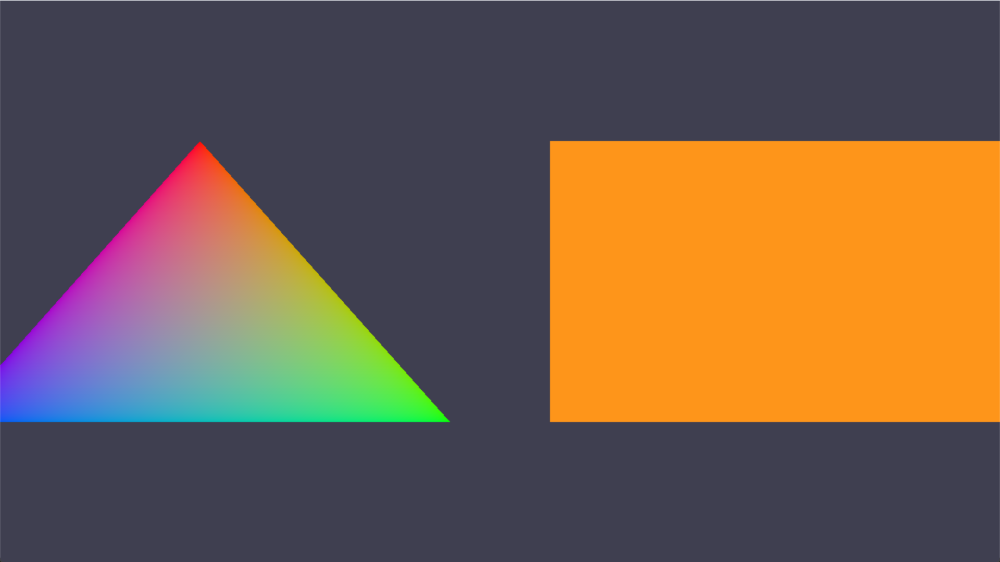
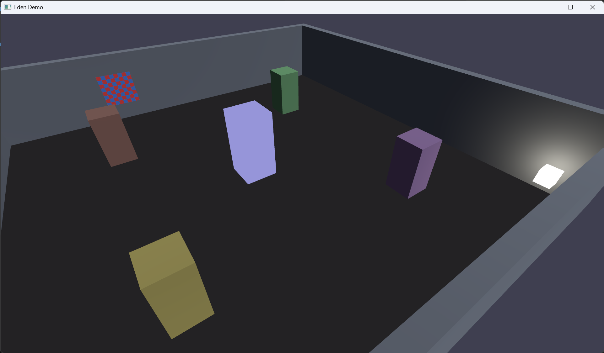

# Eden

[](https://github.com/A-Mamdouh/eden/actions/workflows/ci.yml)
[](https://a-mamdouh.github.io/eden/)
[](LICENSE)

A C++20 graphics engine built around a small, explicit **Service/System**
architecture and a **backend-agnostic renderer contract** — Vulkan is the
only implementation today, but nothing above the renderer boundary knows
that.

**[Full documentation and API reference →](https://a-mamdouh.github.io/eden/)**




## What this is

Eden is a from-scratch engine project, not a game built on an existing
engine. The interesting parts, architecturally:

- A **`Renderer` interface** with zero Vulkan/Metal/D3D types in it —
  retained GPU resources via handles, one `renderFrame()` call per frame.
  `NullRenderer` is a second, headless implementation that exists purely
  to prove the contract is real and to let engine logic be unit-tested
  without a GPU.
- An **entt-backed scene** (`Scene`/`Entity`/components) with a small,
  explicit set of engine **Systems** (`ScriptSystem` → `TransformSystem`
  → `RenderSystem`) that Engine ticks in a fixed order each frame, each
  one only reading what the previous one wrote.
- A **script system** for attaching per-entity behavior
  (`ScriptBehaviour`/`ScriptComponent`) without touching engine internals.
- **Every public type is documented** (Doxygen + Breathe + Sphinx,
  published from CI) and the [architecture page](https://a-mamdouh.github.io/eden/architecture.html)
  is kept honest about what's actually wired up versus what's aspirational
  — no feature is claimed that isn't there.

## Building

Requires the [Vulkan SDK](https://vulkan.lunarg.com/) (for `glslc` and the
Vulkan loader) and CMake 3.21+. Every other dependency (SDL2, EnTT, glm,
spdlog, GoogleTest) is fetched automatically if not already installed.

```sh
cmake -B build -G Ninja
cmake --build build
./build/demo/Eden_Demo
```

```sh
ctest --test-dir build --output-on-failure   # run the test suite
```

### Using Eden from another CMake project

Eden exposes the namespaced target `Eden::Eden`. When Eden is added as a
subproject, only the library is enabled by default; its demo and test suite are
not configured and GoogleTest is not discovered or fetched.

```cmake
include(FetchContent)

FetchContent_Declare(
    Eden
    GIT_REPOSITORY https://github.com/A-Mamdouh/eden.git
    GIT_TAG main # Prefer a release tag or pinned commit in production.
)
FetchContent_MakeAvailable(Eden)

target_link_libraries(MyApplication PRIVATE Eden::Eden)
```

Dependencies fetched by Eden are built statically even when the parent sets
`BUILD_SHARED_LIBS=ON`; Eden does not change that parent setting. Dependencies
already provided by the parent project are left unchanged.

Eden's build options are:

| Option | Standalone default | Dependency default | Purpose |
| --- | ---: | ---: | --- |
| `EDEN_BUILD_LIBRARY` | `ON` | `ON` | Build the `Eden::Eden` library target. |
| `EDEN_BUILD_DEMO` | `ON` | `OFF` | Build the standalone demo. |
| `EDEN_BUILD_TESTS` | `ON` | `OFF` | Fetch/find GoogleTest and build Eden's tests. |
| `EDEN_BUILD_DOCS` | `OFF` | `OFF` | Build the Doxygen/Sphinx documentation. |

The Vulkan SDK remains required when building the library because Eden's
current renderer implementation links the Vulkan loader and compiles shaders
with `glslc`.

## Project layout

```
include/Eden/   Public headers (the only thing an embedding app includes)
src/            Implementation
demo/           A small demo application built against the public API
tests/          Unit tests (GoogleTest)
docs/           Doxygen + Sphinx documentation source
```

## Extending Eden

- **New component** — a plain struct, no base class required (see
  `include/Eden/Services/SceneService/Components.hpp`).
- **New system** — derive from `ISystem`, register it in `Engine::init()`
  in the order it needs to run relative to the existing ones.
- **New script** — derive from `ScriptBehaviour`, override `onUpdate()`,
  attach via `ScriptComponent`. See `demo/scripts/PulseTint.hpp` for a
  minimal example.
- **New renderer backend** — implement the `Renderer` interface
  (`include/Eden/Systems/RenderSystem/Renderer.hpp`); `NullRenderer` is
  the smallest real example of what that takes.

## Current limitations

This is an active portfolio project, not a finished product. Documented
honestly rather than glossed over:

- Only simple asset loading is supported.
- Vulkan is the only renderer backend actually driving pixels;
  `NullRenderer` exists for tests, not for rendering.

## License

[MIT](LICENSE)
